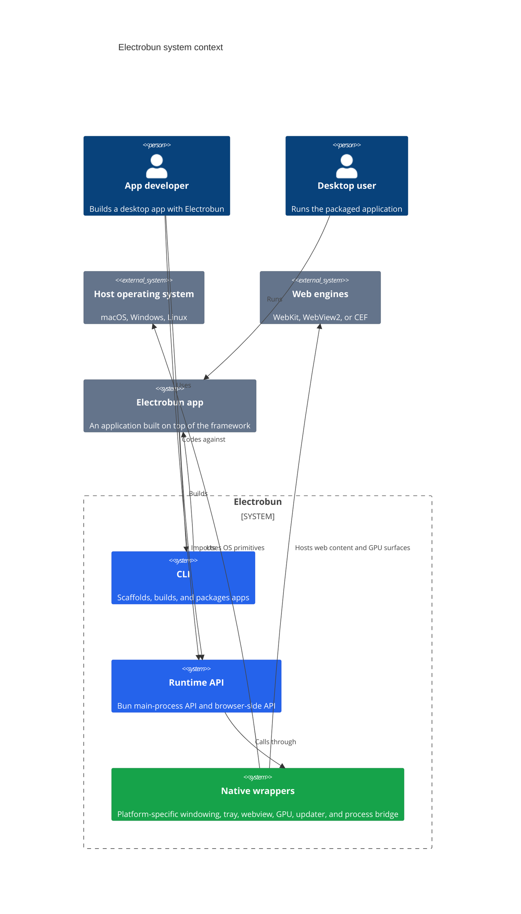
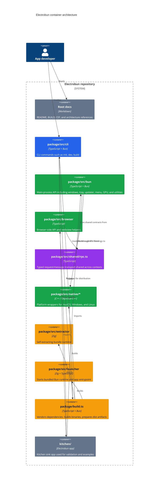
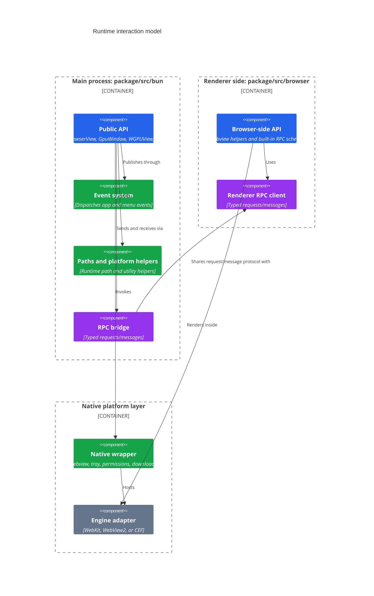
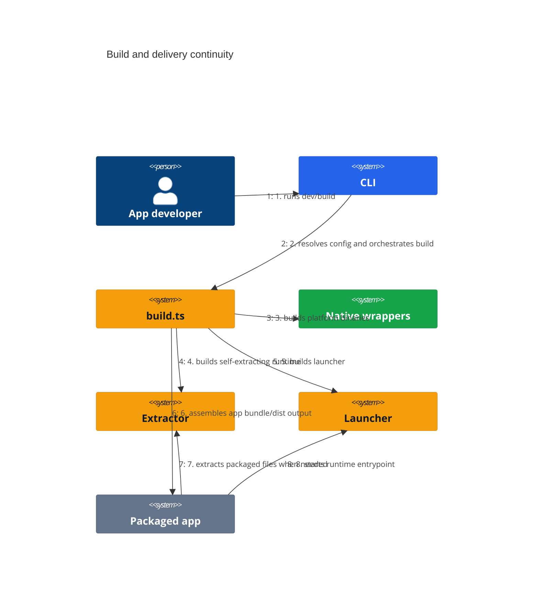

# Electrobun Architecture

This document explains how Electrobun is organized as a desktop application framework, using a gestalt-oriented view of the system:

- **Figure / Ground**: keep the developer-facing API simple while hiding platform detail
- **Proximity**: keep runtime responsibilities close to the process that owns them
- **Similarity**: reuse the same abstractions across platforms and execution contexts
- **Continuity**: make the developer workflow feel like one continuous pipeline
- **Closure**: ship a complete, self-contained runtime that can bootstrap itself

## Color Key

| Color | Meaning | Gestalt principle |
|---|---|---|
| Blue | Public entry points used directly by developers | Figure / Ground |
| Green | Runtime containers that collaborate closely | Proximity |
| Purple | Shared contracts and cross-cutting abstractions | Similarity |
| Amber | Build, packaging, and delivery flow | Continuity |
| Slate | Host platform and final bundled artifact boundary | Closure |

## 1. System Context

Electrobun sits between the app developer and the operating system. It provides a Bun-based main process API, a browser/webview API, native wrappers per platform, and a CLI that turns source code into a runnable desktop bundle.

### Reading the context diagram

- The **CLI** is the main build-time figure.
- The **runtime API** is the main programming figure.
- The **native wrappers** stay in the ground: critical, but mostly hidden behind stable TypeScript entry points.
- The operating system and web engines form the closure boundary that Electrobun must integrate with, but not expose directly for everyday development.

## 2. Container Architecture

The repository is intentionally split into containers that align with the lifecycle of building and running an app.

### Why these containers exist

- **`/package/src/cli`** keeps the developer workflow continuous: scaffold, run, build, and package from one command surface.
- **`/package/src/bun`** holds the main-process figure that app code sees first.
- **`/package/src/browser`** mirrors that figure on the webview side.
- **`/package/src/shared/rpc.ts`** is the similarity layer: one typed contract model, reused across both sides.
- **`/package/src/native`** groups platform-specific behavior by proximity to OS integration concerns.
- **`/package/src/extractor`** and **`/package/src/launcher`** close the delivery loop by turning built assets into a bootable packaged app.

## 3. Runtime Interaction Model

At runtime, the main process owns the application shell while browser views and GPU views host the interactive UI surface.

### Runtime design notes

- **Figure / Ground**: app authors mostly interact with `BrowserWindow`, `BrowserView`, `GpuWindow`, `WGPUView`, `Tray`, and `Updater`.
- **Similarity**: typed RPC keeps the main side and browser side aligned around the same request/message vocabulary.
- **Proximity**: native code stays closest to the OS and rendering engine concerns instead of leaking them upward into app code.

## 4. Delivery Pipeline

Electrobun is designed so the build, packaging, and boot process reads as one continuous flow.

## Source Anchors

These files are the most important anchors for the diagrams above:

- `/home/runner/work/electrobun/electrobun/package/src/bun/index.ts`
- `/home/runner/work/electrobun/electrobun/package/src/browser/index.ts`
- `/home/runner/work/electrobun/electrobun/package/src/cli/index.ts`
- `/home/runner/work/electrobun/electrobun/package/src/shared/rpc.ts`
- `/home/runner/work/electrobun/electrobun/package/src/native/macos/nativeWrapper.mm`
- `/home/runner/work/electrobun/electrobun/package/src/native/win/nativeWrapper.cpp`
- `/home/runner/work/electrobun/electrobun/package/src/native/linux/nativeWrapper.cpp`
- `/home/runner/work/electrobun/electrobun/package/src/extractor/main.zig`
- `/home/runner/work/electrobun/electrobun/package/src/launcher/main.zig`
- `/home/runner/work/electrobun/electrobun/package/build.ts`
