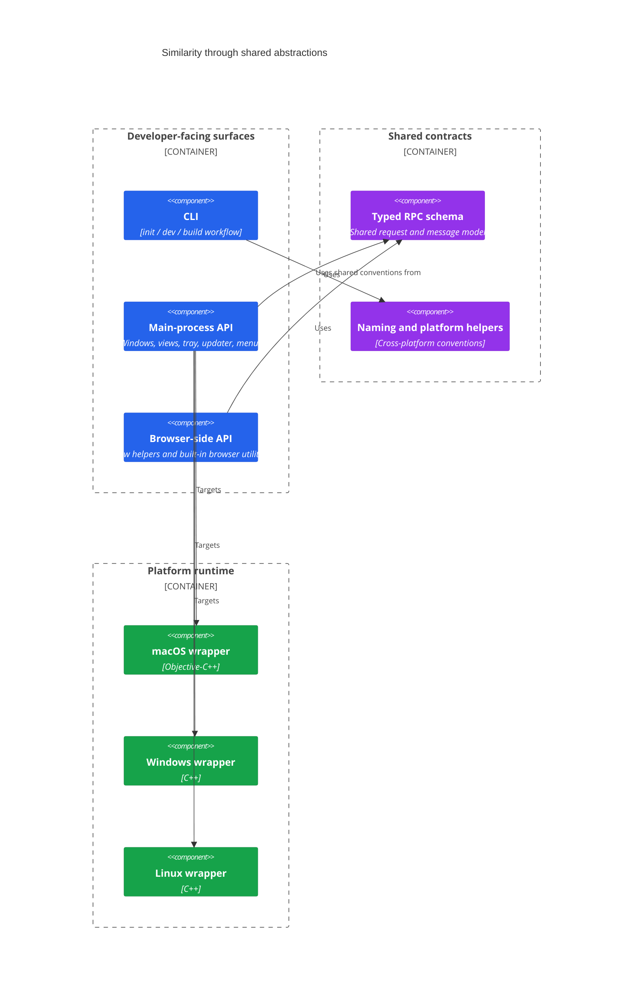

# Electrobun Design Principles

This document organizes Electrobun's design around gestalt principles so the architecture reads as a coherent whole instead of a flat file tree.

## 1. Figure / Ground

Electrobun tries to make the important developer-facing shapes obvious:

- the **CLI** for starting work
- the **main-process API** for desktop behavior
- the **browser-side API** for view behavior

Everything else is deliberately pushed into the ground:

- native wrapper details
- platform-specific rendering engines
- extractor and launcher mechanics
- vendoring and packaging complexity

This is why the public TypeScript surfaces are concentrated in `/package/src/bun` and `/package/src/browser`, while lower-level details stay in `/package/src/native`, `/package/src/extractor`, and `/package/build.ts`.

## 2. Proximity

Electrobun groups code by where responsibility naturally lives:

- **OS-facing concerns** stay close to `/package/src/native/*`
- **runtime API concerns** stay close to `/package/src/bun`
- **browser/webview concerns** stay close to `/package/src/browser`
- **build and distribution concerns** stay close to `/package/build.ts`, `/package/src/extractor`, and `/package/src/launcher`

That keeps each concern near the process, toolchain, or platform boundary that owns it.

## 3. Similarity

Electrobun reuses the same architectural shape across contexts:

- TypeScript is the common language for most high-level developer interaction.
- Typed RPC creates a similar request/message pattern on both main and renderer sides.
- Platform wrappers expose similar capabilities even when implementation details differ per OS.

## 4. Continuity

The intended developer experience is continuous:

1. scaffold or open a project
2. run `electrobun dev`
3. iterate against the kitchen app or an app project
4. package the result
5. ship a bundle that already knows how to launch and, when needed, extract itself

The architecture mirrors that flow:

- `/package/src/cli` starts it
- `/package/build.ts` orchestrates it
- `/package/src/launcher` boots it
- `/package/src/extractor` completes it

## 5. Closure

Electrobun tries to present a finished whole at delivery time:

- the bundle includes the pieces needed to start
- the launcher provides a stable entrypoint
- the extractor fills in packaged runtime files
- native wrappers complete the bridge to the host OS

That closure is especially visible in release packaging, where the framework is not just a library but a full runtime and delivery system.

## 6. Practical Reading Guide

If you are new to the codebase, read it in this order:

1. `./README.md`
2. `./ARCHITECTURE.md`
3. `./BUILD.md`
4. `./CEF.md`
5. `./package/src/bun/index.ts`
6. `./package/src/cli/index.ts`
7. `./package/src/shared/rpc.ts`

That path preserves the gestalt of the system: first the visible whole, then the internal relationships, then the detailed mechanics.
